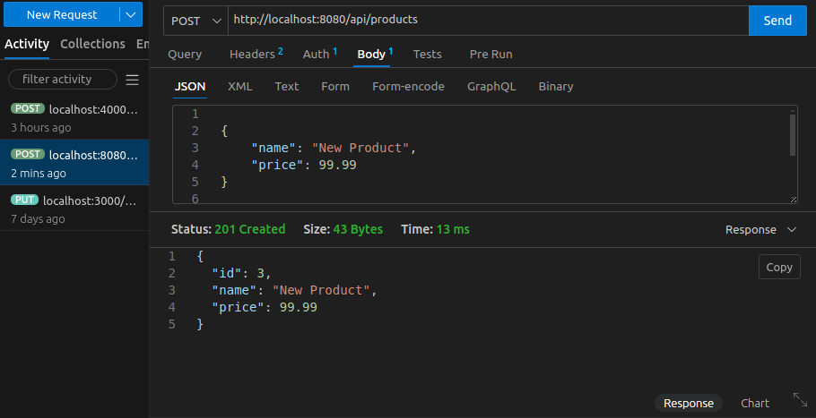

Sure! Here's a basic template for a `README.md` file for your Java RESTful service project. You can modify it as needed based on your project specifics.

```markdown
# Java RESTful Service - Product API

This is a simple Java-based RESTful service that provides an API for managing products. The service allows users to perform CRUD (Create, Read, Update, Delete) operations on products through RESTful endpoints.

## Table of Contents
1. [Project Overview](#project-overview)
2. [Technologies Used](#technologies-used)
3. [Setup and Installation](#setup-and-installation)
4. [API Endpoints](#api-endpoints)
5. [Usage](#usage)
6. [Testing](#testing)
7. [Contributing](#contributing)
8. [License](#license)

## Project Overview

This project provides an API for handling product-related operations. The main functionalities include:
- Creating a new product
- Retrieving details of a product by ID
- Updating product information
- Deleting a product by ID
- Retrieving a list of all products

## Technologies Used

- **Java 8+** - The core programming language.
- **Maven** - For build management and dependencies.
- **Postman** (or similar) - For testing API endpoints.
- **JDK 11+** - Java Development Kit version required for building and running the application.

## Setup and Installation

Follow these steps to set up the project on your local machine:

1. **Clone the repository:**
   ```bash
   git clone https://github.com/yordanos-habtamu/Restful-Java.git
   cd your-repository
   ```

2. **Install dependencies:**
   The project uses Maven for dependency management. Run the following command to download dependencies:
   ```bash
   mvn install
   ```

3. **Build the project:**
   To compile and package the project, run:
   ```bash
   mvn package
   ```

4. **Run the application:**
   You can run the application using Maven:
   ```bash
   mvn clean install
   ```

   And next
   ```bash
  mvn exec:java -Dexec.mainClass="com.example.App"
   ```

The service should now be running on `http://localhost:8080`.

## API Endpoints

### 1. **Get All Products**
   - **Endpoint:** `GET /products`
   - **Description:** Retrieves a list of all products.
   - **Response:**
     ```json
     [
       {
         "id": 1,
         "name": "Product 1",
         "price": 29.99
       },
       {
         "id": 2,
         "name": "Product 2",
         "price": 19.99
       }
     ]
     ```

### 2. **Get Product by ID**
   - **Endpoint:** `GET /products/{id}`
   - **Description:** Retrieves the details of a product by its ID.
   - **Response:**
     ```json
     {
       "id": 1,
       "name": "Product 1",
       "price": 29.99
     }
     ```

### 3. **Create Product**
   - **Endpoint:** `POST /products`
   - **Description:** Creates a new product.
   - **Request Body:**
     ```json
     {
       "name": "New Product",
       "price": 39.99
     }
     ```
   - **Response:**
     ```json
     {
       "id": 3,
       "name": "New Product",
       "price": 39.99
     }
     ```

### 4. **Update Product**
   - **Endpoint:** `PUT /products/{id}`
   - **Description:** Updates the information of an existing product.
   - **Request Body:**
     ```json
     {
       "name": "Updated Product",
       "price": 49.99
     }
     ```
   - **Response:**
     ```json
     {
       "id": 1,
       "name": "Updated Product",
       "price": 49.99
     }
     ```

### 5. **Delete Product**
   - **Endpoint:** `DELETE /products/{id}`
   - **Description:** Deletes a product by its ID.
   - **Response:** `HTTP 204 No Content`

## Usage

- The API runs on `http://localhost:8080` by default.
- Use tools like **Postman** or **curl** to test the API endpoints.

Example using `curl`:
```bash
curl -X GET http://localhost:8080/api/products
```



## Testing

To run the tests for the application, execute the following Maven command:
```bash
mvn test
```

## Contributing

If you would like to contribute to this project, follow these steps:
1. Fork the repository.
2. Create a new branch (`git checkout -b feature-name`).
3. Make your changes and commit them (`git commit -am 'Add new feature'`).
4. Push to your branch (`git push origin feature-name`).
5. Open a pull request.

## License

This project is licensed under the MIT License - see the [LICENSE](LICENSE) file for details.
```
